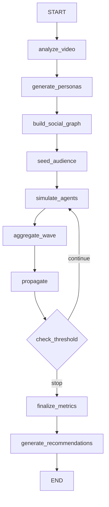

# Viralyst — Project Bible

> **Single source of truth.** If this document and your code disagree, one of them is wrong — decide which, fix it, and update this file. Do not keep a second plan anywhere else.

**Version:** 1.0 (MVP scope, frozen)
**Owner:** _you_
**Build window:** 3 days
**Status legend:** `[ ]` not started · `[~]` in progress · `[x]` done

---

## Table of contents

1. [What Viralyst is](#1-what-viralyst-is)
2. [Scope freeze](#2-scope-freeze)
3. [System architecture](#3-system-architecture)
4. [Technology stack](#4-technology-stack)
5. [Repository structure](#5-repository-structure)
6. [Data contracts](#6-data-contracts)
7. [Module specifications](#7-module-specifications)
8. [The LangGraph workflow](#8-the-langgraph-workflow)
9. [Prompt engineering](#9-prompt-engineering)
10. [Configuration reference](#10-configuration-reference)
11. [Metrics and scoring](#11-metrics-and-scoring)
12. [Streamlit UI specification](#12-streamlit-ui-specification)
13. [Performance budget](#13-performance-budget)
14. [Failure modes and fallbacks](#14-failure-modes-and-fallbacks)
15. [Setup and installation](#15-setup-and-installation)
16. [Three-day build plan](#16-three-day-build-plan)
17. [Testing strategy](#17-testing-strategy)
18. [Honest claims and limitations](#18-honest-claims-and-limitations)
19. [Interview narrative](#19-interview-narrative)
20. [Post-MVP roadmap](#20-post-mvp-roadmap)
21. [Glossary](#21-glossary)

---

## 1. What Viralyst is

### One-line concept

**Viralyst predicts how a short-form video may perform by exposing it to a synthetic audience of AI personas and simulating their engagement and content propagation through a social network.**

### The honest framing

Viralyst is an **AI-powered synthetic audience and content propagation simulator**. It is *not* a statistically validated virality predictor, and nothing in the UI, README, or your interview answer should claim otherwise. The value proposition is:

- You get **directional, explainable feedback** on a video before you publish it.
- The feedback is **segmented** — you learn *who* drops off, not just *that* people drop off.
- The output includes **concrete edit recommendations**, not just a number.

### Category

This is an **Agentic AI + multimodal AI + simulation** project. Three distinct competencies, one pipeline:

| Competency | Demonstrated by |
|---|---|
| Multimodal AI | Whisper (audio) + YOLO (vision) + OpenCV (temporal) fused into one feature vector |
| Agentic AI | LangGraph-orchestrated stateful workflow with per-persona LLM agents and a conditional propagation loop |
| Simulation | NetworkX social graph + probabilistic multi-wave diffusion + metric aggregation |

### User journey

```text
User uploads video.mp4
        │
        ▼
Clicks "Run Viralyst"
        │
        ▼
~90-180 seconds of pipeline
        │
        ▼
Dashboard shows:
    Virality Score
    Engagement metrics
    Audience segment breakdown
    Propagation wave chart + network graph
    AI content recommendations
```

---

## 2. Scope freeze

### 2.1 In scope (build this, nothing more)

- [x] Video ingest (mp4/mov/webm, ≤120 seconds, ≤200 MB)
- [x] Audio extraction + transcription (faster-whisper)
- [x] Frame sampling + object detection (YOLOv8n via ultralytics)
- [x] Temporal/visual statistics (OpenCV)
- [x] Programmatic synthetic persona generation (50–100)
- [x] Homophily-based social graph (NetworkX)
- [x] Per-persona LLM reaction agent (Ollama, structured JSON out)
- [x] LangGraph orchestration with conditional wave loop
- [x] Probabilistic propagation model
- [x] Metric aggregation + weighted virality score
- [x] Segment-level breakdown
- [x] LLM recommendation agent
- [x] Streamlit dashboard
- [x] Feature cache (skip re-analysis of the same video)

### 2.2 Explicitly out of scope

| Not building | Why |
|---|---|
| Real social-media API integration | Not needed; adds auth/quota complexity for zero demo value |
| Replicating Instagram/TikTok's real ranking algorithm | Impossible without proprietary data; claiming it is dishonest |
| Dynamic / learned social graph | Fixed graph per simulation is sufficient and explainable |
| Real-time or distributed architecture | Irrelevant at this scale |
| Database / persistence layer | No users, no accounts, no history required |
| FastAPI backend | Streamlit calls the Python pipeline directly |
| XGBoost or any supervised model | **No labelled target exists.** Adding it would be fake ML |
| OpenCLIP / CLIP embeddings | YOLO + transcript + handcrafted features are enough for MVP |
| Paid VLM (GPT-4V, Gemini Vision, etc.) | Local extraction is cheaper, offline, and demonstrates more skill |
| Auth, multi-tenancy, deployment infra | Out of the 3-day window |

### 2.3 The one rule

> **Do not add a technology until the pipeline runs end-to-end.** If you find yourself installing something not in [section 4](#4-technology-stack), stop and re-read this line.

---

## 3. System architecture

### 3.1 High-level pipeline

```text
                    VIDEO
                      │
                      ▼
             MULTIMODAL ANALYSIS
          ┌───────────┼───────────┐
          │           │           │
       Whisper       YOLO       OpenCV
     (transcript)  (objects)  (temporal)
          │           │           │
          └───────────┼───────────┘
                      │
                      ▼
              VIDEO FEATURES
                      │
                      ▼
             SYNTHETIC AUDIENCE
                50–100 personas
                      │
                      ▼
               NETWORKX GRAPH
                      │
                      ▼
                LANGGRAPH
                WORKFLOW  ◄──────────┐
                      │              │
                      ▼              │
                LLM AGENTS           │
              (one per persona)      │
                      │              │
                      ▼              │
              USER REACTIONS         │
                      │              │
                      ▼              │
            PROPAGATION WAVE ────────┘
                      │        (if threshold met)
                      ▼
            ENGAGEMENT METRICS
                      │
                      ▼
             VIRALITY SCORE
                      │
                      ▼
            AI RECOMMENDATIONS
```

### 3.2 Layer responsibilities

```text
┌───────────────────────────────────────────────────────┐
│ PRESENTATION      app.py (Streamlit)                  │
├───────────────────────────────────────────────────────┤
│ ORCHESTRATION     workflow/graph.py (LangGraph)       │
├───────────────────────────────────────────────────────┤
│ INTELLIGENCE      agents/  (Ollama LLM calls)         │
├───────────────────────────────────────────────────────┤
│ SIMULATION        simulation/  (NetworkX, NumPy)      │
├───────────────────────────────────────────────────────┤
│ PERCEPTION        video/  (Whisper, YOLO, OpenCV)     │
├───────────────────────────────────────────────────────┤
│ POPULATION        personas/  (deterministic RNG)      │
├───────────────────────────────────────────────────────┤
│ FOUNDATION        config.py, schemas.py, utils.py     │
└───────────────────────────────────────────────────────┘
```

**Dependency rule:** layers only import *downward*. `simulation/` must never import `agents/`. `video/` must never import anything above `config.py`. This keeps every module independently testable.

### 3.3 What is AI vs. what is algorithm

Be able to say this cleanly out loud.

**AI-heavy components**

- **LLM persona agents** — simulate audience behaviour and produce structured actions
- **LangGraph** — stateful agentic orchestration with conditional branching
- **Whisper** — automatic speech recognition
- **YOLO** — visual object detection
- **LLM recommendation agent** — interprets simulation output into edit advice

**Algorithmic components**

- **NetworkX** — graph construction and propagation traversal
- **NumPy / Pandas** — aggregation, rates, scoring

**Application layer**

- **Streamlit** — interface

This is why the project is legitimately AI-heavy *without* pretending every line is AI.

---

## 4. Technology stack

### 4.1 Public stack line

> **Python · YOLO · OpenCV · faster-whisper · Ollama · LangGraph · NetworkX · NumPy · Pandas · Streamlit**

Only claim what you actually run.

### 4.2 Pinned dependencies

`requirements.txt`:

```text
# Core
python-dotenv==1.0.1
pydantic==2.9.2
numpy==1.26.4
pandas==2.2.3

# Video / perception
opencv-python-headless==4.10.0.84
faster-whisper==1.0.3
ultralytics==8.3.27

# Agents / orchestration
langgraph==0.2.45
langchain-core==0.3.15
ollama==0.3.3

# Simulation
networkx==3.4.2

# UI
streamlit==1.39.0
plotly==5.24.1
```

**Also required outside pip:**

| Tool | Purpose | Install |
|---|---|---|
| Python 3.11 | Runtime (3.12 also fine; avoid 3.13 for ultralytics wheels) | pyenv / system |
| ffmpeg | Audio extraction for Whisper | `apt install ffmpeg` / `brew install ffmpeg` |
| Ollama | Local LLM server | https://ollama.com |

**Model artifacts (downloaded once):**

| Model | Size | Fetch |
|---|---|---|
| `yolov8n.pt` | ~6 MB | auto-downloaded by ultralytics on first use |
| faster-whisper `base` | ~145 MB | auto-downloaded on first use |
| `llama3.1:8b-instruct-q4_K_M` | ~4.7 GB | `ollama pull llama3.1:8b-instruct-q4_K_M` |

**LLM fallback ladder** (if 8 GB RAM is tight): `qwen2.5:7b-instruct` → `llama3.2:3b-instruct` → `qwen2.5:3b-instruct`. All support JSON-mode output. Set the choice once in `config.py`; never hardcode a model name elsewhere.

---

## 5. Repository structure

```text
viralyst/
│
├── app.py                      # Streamlit entrypoint — UI only, zero business logic
├── config.py                   # All tunables, model names, thresholds, weights
├── schemas.py                  # Pydantic models = the data contracts
├── utils.py                    # Logging, hashing, timing, JSON coercion
│
├── video/
│   ├── __init__.py
│   ├── extractor.py            # OpenCV: metadata, frame sampling, audio extraction
│   ├── transcriber.py          # faster-whisper wrapper  (named whisper.py in the
│   │                           #   original sketch — DO NOT name it whisper.py,
│   │                           #   it shadows the pip package `whisper`)
│   ├── detector.py             # YOLOv8 object detection over sampled frames
│   └── features.py             # Fuses all three into one VideoFeatures object
│
├── personas/
│   ├── __init__.py
│   └── generator.py            # Deterministic synthetic population generator
│
├── agents/
│   ├── __init__.py
│   ├── llm.py                  # Ollama client, JSON mode, retry, concurrency
│   ├── audience.py             # Per-persona reaction agent
│   └── recommender.py          # Post-simulation recommendation agent
│
├── workflow/
│   ├── __init__.py
│   ├── state.py                # SimulationState TypedDict + reducers
│   └── graph.py                # LangGraph nodes, edges, conditional routing
│
├── simulation/
│   ├── __init__.py
│   ├── social_graph.py         # NetworkX graph construction
│   ├── propagation.py          # Wave selection + exposure probability model
│   └── metrics.py              # Rates, virality score, segmentation
│
├── cache/                      # gitignored — feature JSON keyed by video hash
├── tmp/                        # gitignored — extracted audio, frames
├── tests/
│   ├── test_personas.py
│   ├── test_graph.py
│   ├── test_metrics.py
│   └── test_propagation.py
│
├── requirements.txt
├── .env.example
├── .gitignore
├── README.md                   # short public-facing version
└── VIRALYST.md                 # this file
```

### 5.1 File-by-file responsibility table

| Path | Owns | Must NOT |
|---|---|---|
| `app.py` | Layout, upload widget, progress, charts | Contain any scoring, prompting, or graph logic |
| `config.py` | Every magic number in the project | Import from any other project module |
| `schemas.py` | Pydantic models, validation, defaults | Contain behaviour beyond validators |
| `utils.py` | `sha256_file`, `timer`, `setup_logging`, `coerce_json` | Import `video/`, `agents/`, etc. |
| `video/extractor.py` | Open the file, read metadata, sample frames, dump 16 kHz mono wav | Know what a persona is |
| `video/transcriber.py` | Load Whisper once, transcribe wav, return segments | Do sentiment scoring (LLM's job later) |
| `video/detector.py` | Load YOLO once, run batch inference, aggregate counts | Interpret detections semantically |
| `video/features.py` | Orchestrate the three above, compute derived stats, cache | Call an LLM |
| `personas/generator.py` | Build N personas from seeded RNG + archetype table | Call an LLM |
| `agents/llm.py` | One shared Ollama interface, JSON coercion, retries, thread pool | Contain any prompt text |
| `agents/audience.py` | Build the reaction prompt, parse into `Reaction` | Decide who gets exposed |
| `agents/recommender.py` | Build the advisory prompt, parse into `Recommendations` | Recompute metrics |
| `workflow/state.py` | The single state dict shape | Contain node logic |
| `workflow/graph.py` | Node functions + edges + conditional router | Implement metric math inline |
| `simulation/social_graph.py` | Build/validate the NetworkX graph | Run the simulation |
| `simulation/propagation.py` | Choose next wave given reactions + graph | Call an LLM |
| `simulation/metrics.py` | Rates, virality score, segment table | Format anything for display |

---

## 6. Data contracts

Everything crossing a module boundary is a Pydantic model in `schemas.py`. This is what makes the project debuggable.

### 6.1 `VideoFeatures`

```python
class ObjectStats(BaseModel):
    counts: dict[str, int]              # {"person": 17, "phone": 12}
    unique_classes: int
    avg_objects_per_frame: float
    dominant_class: str | None

class VideoFeatures(BaseModel):
    # identity
    video_hash: str
    filename: str

    # temporal (OpenCV)
    duration_sec: float
    fps: float
    frame_count: int
    sampled_frame_count: int
    scene_changes: int
    scene_change_rate: float            # changes per second
    avg_brightness: float               # 0-1
    brightness_variance: float
    motion_score: float                 # 0-1, mean inter-frame abs diff
    aspect_ratio: float
    is_vertical: bool

    # visual (YOLO)
    objects: ObjectStats

    # audio (Whisper)
    transcript: str
    language: str
    word_count: int
    speech_duration_sec: float
    speech_rate_wps: float              # words per second
    silence_ratio: float                # 1 - speech_duration/duration
    has_speech: bool

    # derived
    hook_transcript: str                # first 3 seconds of speech
    pacing_label: str                   # "slow" | "moderate" | "fast"
    density_label: str                  # "sparse" | "balanced" | "busy"
```

**Example instance:**

```json
{
  "video_hash": "9f2c1a...",
  "filename": "demo.mp4",
  "duration_sec": 27.0,
  "fps": 30.0,
  "frame_count": 810,
  "sampled_frame_count": 20,
  "scene_changes": 8,
  "scene_change_rate": 0.296,
  "avg_brightness": 0.61,
  "brightness_variance": 0.04,
  "motion_score": 0.73,
  "aspect_ratio": 0.5625,
  "is_vertical": true,
  "objects": {
    "counts": { "person": 17, "phone": 12, "laptop": 8 },
    "unique_classes": 3,
    "avg_objects_per_frame": 1.85,
    "dominant_class": "person"
  },
  "transcript": "This new AI tool can automatically summarize your meetings...",
  "language": "en",
  "word_count": 94,
  "speech_duration_sec": 24.2,
  "speech_rate_wps": 3.48,
  "silence_ratio": 0.10,
  "has_speech": true,
  "hook_transcript": "This new AI tool can automatically",
  "pacing_label": "fast",
  "density_label": "balanced"
}
```

### 6.2 `Persona`

```python
class Persona(BaseModel):
    id: int
    name: str                           # "P37" — display handle only
    age: int                            # 16-55
    profession: str
    archetype: str                      # segment label, see 7.5
    interests: list[str]                # 2-4 tags

    # Big Five, 0-1
    openness: float
    conscientiousness: float
    extraversion: float
    agreeableness: float
    neuroticism: float

    # behavioural, 0-1
    attention_span: float
    skepticism: float
    share_propensity: float
    comment_propensity: float
    daily_scroll_hours: float           # 0.5-6.0
```

### 6.3 `Reaction`

The **only** thing an audience agent is allowed to return.

```python
class Reaction(BaseModel):
    persona_id: int
    wave: int

    watch_percentage: int = Field(ge=0, le=100)
    skipped: bool
    liked: bool
    commented: bool
    shared: bool
    followed_creator: bool
    purchase_intent: float = Field(ge=0.0, le=1.0)
    reason: str = Field(max_length=280)

    # populated by the runner, not the LLM
    latency_ms: int = 0
    fallback: bool = False              # True if heuristic, not LLM-generated
```

**Consistency validator** (enforced in `schemas.py`, not in the prompt):

```python
@model_validator(mode="after")
def enforce_consistency(self):
    if self.skipped:
        self.watch_percentage = min(self.watch_percentage, 30)
        self.liked = self.commented = self.shared = False
        self.followed_creator = False
    if self.watch_percentage < 25:
        self.shared = False
        self.followed_creator = False
    if self.followed_creator and not (self.liked or self.shared):
        self.liked = True
    return self
```

This is important: LLMs happily return `{"skipped": true, "shared": true}`. Silently repair it rather than discarding the sample.

### 6.4 `Wave`

```python
class Wave(BaseModel):
    index: int
    exposed_ids: list[int]
    new_exposures: int
    cumulative_reached: int
    shares: int
    comments: int
    likes: int
    skips: int
    avg_watch: float
    continued: bool                     # did the threshold pass?
```

### 6.5 `EngagementMetrics`

```python
class SegmentMetrics(BaseModel):
    segment: str
    n: int
    avg_watch: float
    like_rate: float
    share_rate: float
    comment_rate: float
    skip_rate: float

class EngagementMetrics(BaseModel):
    n_reactions: int
    completion_rate: float              # mean watch_percentage / 100
    skip_rate: float
    like_rate: float
    share_rate: float
    comment_rate: float
    follow_rate: float
    avg_purchase_intent: float
    reach: int                          # unique personas exposed
    reach_pct: float                    # reach / population
    virality_score: float               # 0-100
    segments: list[SegmentMetrics]
```

### 6.6 `Recommendations`

```python
class RecommendationItem(BaseModel):
    problem: str
    likely_cause: str
    recommendation: str
    priority: Literal["high", "medium", "low"]
    target_segment: str | None

class Recommendations(BaseModel):
    summary: str                        # 2-3 sentences
    strengths: list[str]
    items: list[RecommendationItem]     # 3-5
```

---

## 7. Module specifications

### 7.1 `video/extractor.py`

**Purpose:** everything that requires opening the video file itself.

```python
def probe(path: str) -> dict
    """Return duration_sec, fps, frame_count, width, height. Uses cv2.VideoCapture."""

def sample_frames(path: str, max_frames: int = 20, target_fps: float = 1.0) -> list[np.ndarray]
    """Sample evenly-spaced BGR frames. Take min(duration*target_fps, max_frames),
       always at least 5. Resize longest side to 640 for YOLO speed."""

def extract_audio(path: str, out_wav: str) -> str | None
    """ffmpeg -i in -ac 1 -ar 16000 -vn out.wav. Return None if no audio stream."""

def temporal_stats(frames: list[np.ndarray]) -> dict
    """avg_brightness, brightness_variance, motion_score, scene_changes."""
```

**Algorithms — be precise, these are interview questions:**

- **Brightness:** convert to grayscale, `mean/255`, averaged across frames.
- **Motion score:** mean absolute difference between consecutive sampled grayscale frames, normalised by 255, clipped to `[0, 1]`.
- **Scene change:** compute a 3-channel colour histogram per frame (8 bins per channel), compare consecutive frames with `cv2.compareHist(..., cv2.HISTCMP_CORREL)`. A correlation below `SCENE_CHANGE_THRESHOLD` (default `0.6`) counts as a cut. Since frames are sampled at ~1 fps this counts *approximate* cuts, not exact ones — say so if asked.

**Failure handling:** if `cv2.VideoCapture` fails to open, raise `VideoReadError` with the codec info. If `fps` reads as 0 (some webm files), fall back to `frame_count / duration` or default 30.

---

### 7.2 `video/transcriber.py`

**Purpose:** speech → text. Named `transcriber.py`, **not** `whisper.py`, to avoid shadowing.

```python
_MODEL = None

def get_model() -> WhisperModel
    """Lazy singleton. WhisperModel(WHISPER_MODEL_SIZE, device='cpu',
       compute_type='int8'). Loading takes ~5s — never load per request."""

def transcribe(wav_path: str) -> TranscriptResult
    """Returns transcript text, language, segments[(start,end,text)],
       speech_duration_sec (sum of segment durations), word_count."""

def hook_text(segments, seconds: float = 3.0) -> str
    """Concatenate text from segments overlapping [0, seconds]."""
```

**Settings:** `beam_size=1`, `vad_filter=True`, `condition_on_previous_text=False`. VAD filtering matters — it prevents Whisper hallucinating text over music-only stretches.

**Silence case:** if no audio stream or zero segments returned, set `has_speech=False`, `transcript=""`, and let the audience prompt describe it as a *silent/music-only* video. Do not crash, and do not invent a transcript.

---

### 7.3 `video/detector.py`

**Purpose:** what's visually in the frame.

```python
_MODEL = None

def get_model() -> YOLO
    """Lazy singleton: YOLO('yolov8n.pt'). Downloads ~6MB once."""

def detect(frames: list[np.ndarray], conf: float = 0.35) -> ObjectStats
    """Batch inference over sampled frames. Aggregate class counts across all
       frames (so 'person' appearing in 17 frames counts 17). Compute
       unique_classes, avg_objects_per_frame, dominant_class."""
```

**Interpretation discipline:** YOLO is *not* predicting virality. It provides **visual features about the content**. `person: 17` means "a person was detected in 17 sampled-frame detections", i.e. a face-forward talking-head video. That's a feature for the LLM to reason over, nothing more. YOLO's COCO vocabulary is 80 classes and will never detect "product demo" or "meme text" — acknowledge this limitation rather than over-reading detections.

---

### 7.4 `video/features.py`

**Purpose:** fuse the three perception modules and cache the result.

```python
def analyze_video(path: str, use_cache: bool = True) -> VideoFeatures
    """
    1. hash = sha256_file(path)[:16]
    2. if cache/{hash}.json exists and use_cache: return VideoFeatures(**json)
    3. meta   = extractor.probe(path)
    4. frames = extractor.sample_frames(path)
    5. stats  = extractor.temporal_stats(frames)
    6. objs   = detector.detect(frames)
    7. wav    = extractor.extract_audio(path, tmp/)
    8. tr     = transcriber.transcribe(wav) if wav else EMPTY
    9. derive pacing_label, density_label, silence_ratio, speech_rate_wps
    10. write cache, return VideoFeatures
    """
```

**Derived label rules** (deterministic, documented, defensible):

```python
speech_rate_wps = word_count / max(speech_duration_sec, 1e-6)

pacing_label = ("fast"     if speech_rate_wps > 3.2 or scene_change_rate > 0.4
                else "slow" if speech_rate_wps < 1.8 and scene_change_rate < 0.15
                else "moderate")

density_label = ("busy"    if avg_objects_per_frame > 4
                 else "sparse" if avg_objects_per_frame < 1
                 else "balanced")
```

The cache is why iterating on prompts is fast — you analyse a video once, then re-run the simulation twenty times in seconds.

---

### 7.5 `personas/generator.py`

**Purpose:** build a heterogeneous synthetic population **programmatically in Python — not with the LLM.**

**Why not LLM-generated personas?** Three reasons, and you should be able to give all three: (1) determinism — a seeded RNG reproduces the exact same population, which is required for comparing two videos fairly; (2) cost — 100 extra LLM calls for no gain; (3) distributional control — you can *guarantee* the population contains 12% skeptics, whereas an LLM will drift toward whatever it finds plausible.

**Why heterogeneity matters at all:**

```text
BAD                            GOOD
100 identical LLM calls        Tech enthusiast     → loves it
        ↓                      Casual viewer       → skips
100 identical reactions        Marketing student   → interested
                               Skeptical developer → dislikes hype
                               Gaming enthusiast   → doesn't care
```

**Archetype table** (the segment labels used everywhere downstream):

| Archetype | Weight | Age range | Interests pool | Trait skew |
|---|---|---|---|---|
| `tech_enthusiast` | 0.18 | 18–35 | AI, technology, gadgets, startups | openness ↑, share ↑ |
| `student` | 0.20 | 16–24 | study, gaming, music, memes | attention ↓, share ↑ |
| `developer` | 0.14 | 22–40 | programming, AI, open source | skepticism ↑↑, share ↓ |
| `marketer` | 0.12 | 24–42 | marketing, business, design | comment ↑, purchase_intent ↑ |
| `creator` | 0.10 | 18–35 | content, video, photography | comment ↑↑, share ↑ |
| `professional` | 0.14 | 28–55 | business, finance, productivity | attention ↑, share ↓ |
| `casual_viewer` | 0.12 | 16–50 | entertainment, food, travel, sports | attention ↓↓, skepticism ↓ |

```python
def generate_personas(n: int = 100, seed: int = 42) -> list[Persona]
    """
    rng = np.random.default_rng(seed)
    1. Draw archetypes via rng.choice(archetypes, p=weights)
    2. For each: age ~ uniform(range), profession from archetype table
    3. interests = rng.choice(pool, size=rng.integers(2,5), replace=False)
    4. Big Five ~ clip(Beta(2,2) shifted by archetype skew, 0.05, 0.95)
    5. attention_span, skepticism, share_propensity, comment_propensity
       ~ same, with skew
    6. name = f"P{i}"
    """

def population_summary(personas) -> pd.DataFrame
    """Archetype counts + mean traits. Displayed in the UI sidebar."""
```

**Reproducibility contract:** `generate_personas(100, seed=42)` must return byte-identical output on every run and every machine. Test this (`tests/test_personas.py`).

---

### 7.6 `simulation/social_graph.py`

**Purpose:** turn 100 personas into a plausible social network.

**Model: homophily + small-world.** Real social networks have high clustering (your friends know each other) and short path lengths (six degrees). Pure random graphs have the second but not the first. So:

```python
def build_graph(personas: list[Persona], seed: int = 42) -> nx.Graph
    """
    1. Add a node per persona, with the full persona dict as node attrs.
    2. HOMOPHILY EDGES: for each pair (i,j), compute similarity:
           s = 0.50 * jaccard(interests_i, interests_j)
             + 0.20 * (1 - |age_i - age_j| / 40)
             + 0.15 * (1 if archetype_i == archetype_j else 0)
             + 0.15 * (1 - mean|bigfive_i - bigfive_j|)
       Connect if s > HOMOPHILY_THRESHOLD (0.45), capped at
       MAX_DEGREE (12) per node — keep each node's top-k by similarity.
    3. RANDOM BRIDGES: add RANDOM_EDGE_RATIO (0.05) * n random edges
       to create weak ties between clusters.
    4. CONNECTIVITY REPAIR: if the graph is disconnected, link each
       component's highest-degree node to the giant component.
    5. EDGE WEIGHT: store w = similarity (used to modulate exposure).
    """

def graph_stats(G) -> dict
    """n_nodes, n_edges, avg_degree, density, clustering coefficient,
       n_components, largest_component_size. Shown in the UI."""

def select_seed_users(G, personas, k: int = 5, seed: int = 42) -> list[int]
    """Seed strategy 'mixed' (default): 2 highest-degree nodes (influencers)
       + 3 uniformly random. Configurable: 'random' | 'degree' | 'mixed'."""
```

Visual intuition:

```text
P1 ───── P4
│       / │
│      /  │
P2 ── P7 ─ P9
      │
      P15
```

**The graph is built once, before the simulation, and is frozen for the duration of that run.** Do not mutate it between waves.

---

### 7.7 `simulation/propagation.py`

**Purpose:** given who reacted how, decide who sees the video next.

**Exposure probability model** — the core simulation parameter table:

| Action by user A | P(neighbour B is exposed) |
|---|---|
| shared | 0.80 |
| commented | 0.40 |
| liked | 0.20 |
| watched but no action | 0.05 |
| skipped | 0.00 |

> These are **simulation parameters**, not claims about Instagram's or TikTok's actual algorithms. State that distinction explicitly if asked. They're chosen to be interpretable and monotonic in engagement intensity.

**Do not make propagation deterministic.** "Everyone connected to a sharer sees the video" produces a degenerate, uninteresting cascade and is obviously wrong. Roll the dice.

```python
def next_wave(G, reactions: list[Reaction], already_exposed: set[int],
              rng, max_new: int = 30) -> list[int]
    """
    candidates = {}
    for r in reactions:
        p_base = EXPOSURE_PROBS[dominant_action(r)]
        for nbr in G.neighbors(r.persona_id):
            if nbr in already_exposed: continue
            # edge weight modulates: closer ties propagate better
            p = p_base * (0.7 + 0.3 * G[r.persona_id][nbr]['weight'])
            # a neighbour reachable from two sharers gets two chances
            candidates[nbr] = 1 - (1 - candidates.get(nbr, 0)) * (1 - p)

    exposed = [nid for nid, p in candidates.items() if rng.random() < p]
    if len(exposed) > max_new:                  # cap for runtime safety
        exposed = sorted(exposed, key=lambda n: -candidates[n])[:max_new]
    return exposed
    """

def should_continue(wave: Wave, wave_index: int, reached: int,
                    population: int) -> tuple[bool, str]
    """Continue only if ALL hold:
         wave_index + 1 < MAX_WAVES              (default 4)
         wave.new_exposures >= MIN_NEW_EXPOSURES (default 3)
         wave share_rate >= CONTINUE_SHARE_RATE  (default 0.05)
         reached / population < 0.85
       Return (bool, human-readable stop reason for the UI)."""
```

**Worked example:**

```text
Seed Wave (5 users)
P3 → share   P17 → skip   P24 → like   P41 → share   P73 → skip
     ↓
P3 shared          P41 shared
 ├── P8             ├── P14
 ├── P11            ├── P33
 └── P29            └── P52
     ↓
Wave 1 → P8, P11, P29, P14, P33, P52   (those that passed the dice roll)
     ↓
Wave 2 → ...
```

Stop when the threshold fails, `MAX_WAVES` is hit, or 85% of the population has been reached.

---

### 7.8 `agents/llm.py`

**Purpose:** the single choke point for every LLM call in the project.

```python
def chat_json(system: str, user: str, schema_hint: str,
              temperature: float = 0.7, retries: int = 1) -> dict
    """
    ollama.chat(model=OLLAMA_MODEL, format='json',
                options={'temperature': t, 'num_predict': 300,
                         'num_ctx': 4096})
    - Parse response. On JSONDecodeError, strip ``` fences and retry parse.
    - On failure, re-prompt once with: 'Your previous output was invalid
      JSON. Return ONLY a JSON object matching: {schema_hint}'
    - On second failure, raise LLMFormatError.
    """

def run_batch(jobs: list[Callable], max_workers: int = 6,
              progress_cb=None) -> list
    """ThreadPoolExecutor. Ollama serialises internally but overlapping
       requests still improves throughput. Report progress per completion
       so Streamlit's progress bar moves."""

def health_check() -> tuple[bool, str]
    """Ping Ollama, verify OLLAMA_MODEL is pulled. Called at app start so
       the user gets 'Run: ollama pull ...' instead of a stack trace."""
```

**Temperature policy:** audience agents run at `0.7` (you *want* behavioural variance); the recommender runs at `0.3` (you want stable, grounded advice).

---

### 7.9 `agents/audience.py`

```python
def build_prompt(features: VideoFeatures, persona: Persona) -> tuple[str, str]

def react(features: VideoFeatures, persona: Persona, wave: int) -> Reaction
    """chat_json → validate into Reaction → on LLMFormatError, return
       heuristic_reaction(features, persona, wave) with fallback=True."""

def heuristic_reaction(features, persona, wave) -> Reaction
    """Deterministic non-LLM fallback so one bad parse never kills a run:
         interest_match = |persona.interests ∩ topic_keywords| / len(interests)
         base_watch     = 40 + 40*interest_match + 20*persona.attention_span
         watch         -= 15 if duration > 45 else 0
         liked          = watch > 60 and rng < 0.5 + 0.3*interest_match
         shared         = liked and rng < persona.share_propensity * 0.4
       Mark fallback=True and surface the fallback count in the UI."""

def react_many(features, personas, wave, progress_cb) -> list[Reaction]
```

**Target:** fallback rate under 5%. If it's higher, your prompt or model choice is wrong — fix the prompt, don't raise the threshold.

---

### 7.10 `agents/recommender.py`

```python
def recommend(features: VideoFeatures, metrics: EngagementMetrics,
              waves: list[Wave], sample_reasons: list[str]) -> Recommendations
    """One LLM call, temperature 0.3. Input:
         - compact video feature summary
         - overall metrics
         - the segment table
         - 8-12 sampled `reason` strings, biased toward skippers
           (this is what makes the advice specific rather than generic)
       Output: validated Recommendations."""
```

Sampling the *reasons* is the trick that lifts this from horoscope-tier output to something that actually names the problem. Weight the sample toward low-watch personas — that's where the diagnostic signal is.

---

### 7.11 `simulation/metrics.py`

```python
def aggregate(reactions: list[Reaction], personas: list[Persona],
              reached: int, population: int) -> EngagementMetrics

def virality_score(m: dict) -> float

def segment_table(reactions, personas) -> list[SegmentMetrics]
    """Group by persona.archetype. Suppress segments with n < 3 from display
       (label them 'insufficient sample') — do not report a 100% share rate
       computed from one persona."""
```

Formulas are in [section 11](#11-metrics-and-scoring).

---

## 8. The LangGraph workflow

**LangGraph is the orchestration layer.** It owns the state of the simulation and the conditional loop. This is the "agentic" core of the project — without it you'd have a script; with it you have a stateful workflow with branching.

### 8.1 Graph topology

```text
START
  │
  ▼
analyze_video
  │
  ▼
generate_personas
  │
  ▼
build_social_graph
  │
  ▼
seed_audience
  │
  ▼
simulate_agents  ◄──────────────┐
  │                             │
  ▼                             │
aggregate_wave                  │
  │                             │
  ▼                             │
propagate                       │
  │                             │
  ▼                             │
check_threshold                 │
  │                             │
  ├── continue ─────────────────┘
  │
  └── stop
        │
        ▼
  finalize_metrics
        │
        ▼
  generate_recommendations
        │
        ▼
       END
```

Mermaid version (renders in most markdown viewers):



### 8.2 State definition — `workflow/state.py`

```python
class SimulationState(TypedDict):
    # inputs
    video_path: str
    config: dict

    # perception
    video_features: dict          # VideoFeatures.model_dump()

    # population
    personas: list[dict]
    social_graph: Any             # nx.Graph, not serialised
    graph_stats: dict

    # simulation loop
    wave_index: int
    active_users: list[int]       # who is being simulated THIS wave
    pending_users: list[int]      # propagation candidates, not committed yet
    exposed_ids: list[int]        # cumulative
    reactions: Annotated[list[dict], operator.add]   # accumulates
    waves: list[dict]
    continue_simulation: bool

    # output
    engagement_metrics: dict
    virality_score: float
    recommendations: dict

    # observability
    stop_reason: str
    timings: dict
    errors: list[str]
```

Only `reactions` uses an additive reducer — every other field is last-write-wins. Getting this wrong is the #1 LangGraph bug: if you forget the reducer, each wave silently overwrites the previous wave's reactions and your final metrics are computed from wave 3 alone.

### 8.3 Node contracts

| Node | Reads | Writes | Notes |
|---|---|---|---|
| `analyze_video` | `video_path` | `video_features` | Cached by hash; the slow one on first run |
| `generate_personas` | `config.n_personas`, `seed` | `personas` | Deterministic |
| `build_social_graph` | `personas` | `social_graph`, `graph_stats` | Frozen after this point |
| `seed_audience` | `social_graph` | `active_users`, `exposed_ids`, `wave_index=0` | k=5 mixed strategy |
| `simulate_agents` | `video_features`, `personas`, `active_users` | `reactions` (append) | Parallel LLM calls |
| `aggregate_wave` | `reactions`, `wave_index` | `waves` (append) | Per-wave stats only |
| `propagate` | `social_graph`, last wave's reactions | `pending_users` | Probabilistic; candidates are not reach yet |
| `check_threshold` | last `waves` entry, `pending_users` | `active_users`, `exposed_ids`, `wave_index`, `stop_reason` | Commits pending users only when continuation passes |
| `finalize_metrics` | all `reactions` | `engagement_metrics`, `virality_score` | Global aggregation |
| `generate_recommendations` | features + metrics + reasons | `recommendations` | One LLM call |

### 8.4 The conditional edge

```python
def route_after_threshold(state: SimulationState) -> Literal["simulate_agents", "finalize_metrics"]:
    return (
        "simulate_agents"
        if state["continue_simulation"]
        else "finalize_metrics"
    )

builder.add_conditional_edges("check_threshold", route_after_threshold,
                              {"simulate_agents": "simulate_agents",
                               "finalize_metrics": "finalize_metrics"})
```

`check_threshold` calculates the decision once, commits `pending_users` only
when continuing, and advances `wave_index`. The router only reads the stored
Boolean. **Hard safety net:** `MAX_WAVES` is checked inside `should_continue`,
the wave index advances exactly once per admitted wave, and graph invocation
uses an explicit recursion limit. An infinite local-LLM loop must remain
impossible.

### 8.5 Streaming progress to the UI

Run the graph with `app.stream(initial_state)` rather than `.invoke()`, and update the Streamlit status widget on each node completion. Users will not wait 3 minutes at a blank screen, but they will happily wait 3 minutes watching "Wave 2 — simulating 13 personas…".

---

## 9. Prompt engineering

### 9.1 Audience agent — system prompt

```text
You are simulating a single social-media user's authentic reaction to a
short-form video. You are NOT an assistant and you are NOT evaluating the
video's quality objectively. You embody one specific person with specific
tastes, patience, and biases.

Rules:
- Be decisive. Real users skip fast and share rarely.
- Low attention_span means you stop watching early unless the hook grabs you.
- High skepticism means you distrust bold or unproven claims.
- Sharing is RARE. Only share if you would genuinely put your name on this.
- Your `reason` must reference something specific about THIS video.

Return ONLY a JSON object. No prose, no markdown fences.
```

### 9.2 Audience agent — user prompt template

```text
VIDEO
Duration: {duration_sec}s ({"vertical" if is_vertical else "horizontal"})
Pacing: {pacing_label} | Speech rate: {speech_rate_wps} words/sec
Visual density: {density_label} | Scene changes: {scene_changes}
Objects on screen: {top_5_objects}
Brightness: {avg_brightness} | Motion: {motion_score}

First 3 seconds (the hook):
"{hook_transcript}"

Full transcript ({word_count} words):
"{transcript_truncated_to_600_chars}"

YOU
Age: {age} | Profession: {profession}
Interests: {interests}
Openness: {openness} | Conscientiousness: {conscientiousness}
Extraversion: {extraversion} | Agreeableness: {agreeableness}
Neuroticism: {neuroticism}
Attention span: {attention_span} | Skepticism: {skepticism}
Share propensity: {share_propensity} | Comment propensity: {comment_propensity}

Simulate how YOU would react to this video while scrolling.

Return exactly this JSON shape:
{
  "watch_percentage": <int 0-100>,
  "skipped": <bool>,
  "liked": <bool>,
  "commented": <bool>,
  "shared": <bool>,
  "followed_creator": <bool>,
  "purchase_intent": <float 0-1>,
  "reason": "<one sentence, max 30 words>"
}
```

**Design notes:**

- Traits are passed as **numbers, not adjectives**. Numbers give the model a gradient; "you are quite skeptical" gives it a cliché.
- The hook is separated from the full transcript because early drop-off is the single most important dynamic in short-form video, and you want the model to weigh it.
- Transcript is truncated to ~600 characters. Longer inputs slow every one of your 60+ calls and add nothing.
- Never include the word "viral" in the persona prompt. It biases the model toward optimism.

### 9.3 Recommender — system prompt

```text
You are a short-form video strategist reviewing simulation output from a
synthetic-audience test. The audience was simulated, not real — treat the
numbers as directional signals, not measurements.

Your job: identify why engagement broke down for specific audience segments
and give concrete, actionable edits. Reference actual timestamps, hook
wording, pacing, or visual choices. Never give generic advice such as
"add a strong call to action" or "improve your thumbnail".

Return ONLY a JSON object.
```

### 9.4 Recommender — output shape

```json
{
  "summary": "Strong resonance with technical audiences, weak retention among casual viewers driven by a slow opening.",
  "strengths": ["Clear value proposition", "Good pacing after the 5s mark"],
  "items": [
    {
      "problem": "Casual viewers show a 61% skip rate.",
      "likely_cause": "The product benefit is not stated until roughly 7 seconds in; the opening is setup framing.",
      "recommendation": "Cut the first 5 seconds and open on the summarized-meeting output. State the benefit within 3 seconds.",
      "priority": "high",
      "target_segment": "casual_viewer"
    }
  ]
}
```

### 9.5 Prompt iteration workflow

Because features are cached, you can iterate on prompts cheaply:

```bash
python -m scripts.dry_run --video sample.mp4 --n 10 --seed 42
```

Write this 20-line script on day 2. It runs 10 personas, prints the reactions table, and reports the fallback rate. Do not tune prompts through the Streamlit UI — it's too slow a loop.

---

## 10. Configuration reference

Everything tunable lives in `config.py`. No magic numbers anywhere else in the codebase.

```python
# ── Models ────────────────────────────────────────────────
OLLAMA_MODEL         = "llama3.1:8b-instruct-q4_K_M"
OLLAMA_HOST          = "http://localhost:11434"
WHISPER_MODEL_SIZE   = "base"        # tiny | base | small
WHISPER_COMPUTE_TYPE = "int8"
YOLO_MODEL           = "yolov8n.pt"
YOLO_CONF            = 0.35

# ── Video ─────────────────────────────────────────────────
MAX_VIDEO_SECONDS      = 120
MAX_UPLOAD_MB          = 200
FRAME_SAMPLE_FPS       = 1.0
MAX_SAMPLED_FRAMES     = 20
MIN_SAMPLED_FRAMES     = 5
FRAME_RESIZE_LONG_SIDE = 640
SCENE_CHANGE_THRESHOLD = 0.60        # hist correlation below this = cut

# ── Population ────────────────────────────────────────────
N_PERSONAS = 100
RANDOM_SEED = 42

# ── Social graph ──────────────────────────────────────────
HOMOPHILY_THRESHOLD = 0.45
MAX_DEGREE          = 12
RANDOM_EDGE_RATIO   = 0.05
SEED_SIZE           = 5
SEED_STRATEGY       = "mixed"        # random | degree | mixed

# ── Propagation ───────────────────────────────────────────
EXPOSURE_PROBS = {
    "share":   0.80,
    "comment": 0.40,
    "like":    0.20,
    "watch":   0.05,
    "skip":    0.00,
}
MAX_WAVES            = 4
MIN_NEW_EXPOSURES    = 3
CONTINUE_SHARE_RATE  = 0.05
MAX_NEW_PER_WAVE     = 30
SATURATION_PCT       = 0.85

# ── Scoring ───────────────────────────────────────────────
W_COMPLETION = 0.40
W_SHARE      = 0.30
W_COMMENT    = 0.20
W_SKIP       = -0.10
REACH_BONUS_MAX = 10.0               # added on top of the base score

# ── Agents ────────────────────────────────────────────────
AUDIENCE_TEMPERATURE    = 0.70
RECOMMENDER_TEMPERATURE = 0.30
MAX_WORKERS             = 6
LLM_RETRIES             = 1
TRANSCRIPT_CHAR_LIMIT   = 600
HOOK_SECONDS            = 3.0

# ── Paths ─────────────────────────────────────────────────
CACHE_DIR = "cache"
TMP_DIR   = "tmp"
```

Expose `N_PERSONAS`, `SEED_SIZE`, `MAX_WAVES`, `RANDOM_SEED`, and the share exposure probability in the Streamlit sidebar as an "Advanced" expander. Being able to twist the knobs live during a demo is worth a lot.

---

## 11. Metrics and scoring

### 11.1 Rate definitions

Let `N` be the number of reactions collected across all waves.

```text
Completion rate  C = (Σ watch_percentage) / (100 · N)
Skip rate        K = skips / N
Share rate       S = shares / N
Comment rate     M = comments / N
Like rate        L = likes / N
Follow rate      F = follows / N
Reach            R = |unique exposed personas|
Reach %          R% = R / population
```

Note that these are computed over **exposed** personas, not the full population. A persona who was never reached contributes nothing — that's the whole point of the propagation model. Report `reach_pct` alongside the rates so the denominator is never ambiguous.

### 11.2 Virality score

An interpretable weighted score, deliberately not a learned model:

```text
V_raw = 0.4·C + 0.3·S + 0.2·M − 0.1·K
V_base = clip(V_raw, 0, 1) × 100
V = clip(V_base + reach_bonus, 0, 100)

where reach_bonus = REACH_BONUS_MAX × reach_pct
```

Worked example:

```text
Completion = 0.76    Share = 0.14    Comment = 0.09    Skip = 0.18
Reach      = 0.62

V_raw  = 0.4(0.76) + 0.3(0.14) + 0.2(0.09) − 0.1(0.18)
       = 0.304 + 0.042 + 0.018 − 0.018
       = 0.346
V_base = 34.6
```

⚠️ **Note the scale problem, and handle it.** Raw weighted rates cluster in the 25–45 band because share and comment rates are naturally small. A dashboard where every video scores ~35/100 is useless. Apply a documented calibration curve so the score uses the full range:

```python
def virality_score(C, S, M, K, reach_pct):
    raw = W_COMPLETION*C + W_SHARE*S + W_COMMENT*M + W_SKIP*K
    raw = max(0.0, min(1.0, raw))
    # Piecewise-linear calibration mapping the realistic 0.10-0.55
    # operating band onto 0-100. Documented, monotonic, NOT fitted to data.
    calibrated = np.interp(raw, [0.00, 0.15, 0.30, 0.40, 0.55, 1.00],
                                [0,    25,   50,   70,   90,   100])
    return float(np.clip(calibrated + REACH_BONUS_MAX*reach_pct, 0, 100))
```

Be upfront that the calibration curve is a **presentation choice**, not a fitted model. It preserves ordering — if video A scores higher than video B before calibration, it scores higher after. That's the only property that matters for a comparative tool.

**Label bands for the UI:**

| Score | Label | Colour |
|---|---|---|
| 80–100 | Strong potential | green |
| 60–79 | Above average | teal |
| 40–59 | Mixed | amber |
| 20–39 | Weak | orange |
| 0–19 | Poor fit | red |

### 11.3 Segmentation

Group all reactions by `persona.archetype`:

```text
Audience Segment       n    Avg Watch    Like    Share    Skip
------------------------------------------------------------------
AI enthusiasts        14       88%       71%      21%      7%
Students              19       79%       58%      16%     14%
Developers            11       73%       45%      13%     22%
Marketing              9       69%       52%      10%     19%
Casual viewers        12       51%       23%       5%     44%
```

This is where the real insight lives:

> The video resonates strongly with technology-oriented users but performs poorly among casual viewers.

Suppress any segment with `n < 3` from the displayed table — mark it "insufficient sample" rather than reporting noise as a percentage.

### 11.4 Per-wave metrics

Track and chart:

```text
Wave 0 →  5 users   avg watch 74%   2 shares
Wave 1 → 13 users   avg watch 68%   3 shares
Wave 2 → 28 users   avg watch 61%   4 shares
Wave 3 → 41 users   avg watch 54%   2 shares
```

The **decay in average watch across waves** is a genuinely interesting emergent property: propagation reaches progressively less-similar people, so engagement should degrade. If your simulation shows *flat* watch across waves, your homophily model isn't working — investigate.

---

## 12. Streamlit UI specification

`app.py` contains layout only. Every computation is a call into the pipeline.

### 12.1 Screen 1 — Upload

```text
┌─────────────────────────────┐
│ Upload your video           │
│                             │
│      [ Browse files ]       │
└─────────────────────────────┘

        [ Run Viralyst ]
```

Sidebar (always visible):
- Ollama health indicator: 🟢 connected / 🔴 not running (with the `ollama pull` command)
- **Advanced** expander: persona count, seed size, max waves, random seed, share-exposure probability
- Population summary once generated

Validate before running: file type in `{mp4, mov, webm, avi}`, size ≤ `MAX_UPLOAD_MB`, duration ≤ `MAX_VIDEO_SECONDS`.

### 12.2 Screen 2 — Running

`st.status` container with live node updates:

```text
✓ Analyzing video          (12.4s)
✓ Generating 100 personas   (0.1s)
✓ Building social graph     (0.3s)
⣾ Wave 1 — simulating 13 personas...
```

### 12.3 Screen 3 — Results

**Tab 1 · Overview**

```text
┌──────────────────────────────┐
│ Virality Score     78 / 100  │
├──────────────────────────────┤
│ Watch Rate          76%      │
│ Skip Rate           18%      │
│ Like Rate           64%      │
│ Share Rate          14%      │
│ Comment Rate         9%      │
│ Reach          62 / 100      │
└──────────────────────────────┘
```

Gauge chart for the score, `st.metric` row for the rates. Below it, a one-line honesty caption:

> *Simulated on 100 synthetic personas. This is a directional signal, not a validated prediction.*

**Tab 2 · Video analysis**

```text
Duration       27 sec
Objects        Person, Phone, Laptop
Speech         94 words · 3.5 words/sec (fast)
Scene Changes  8
Brightness     0.61     Motion  0.73
```

Plus the sampled-frame filmstrip and the full transcript in an expander.

**Tab 3 · Audience**

Segment table (§11.3) plus a grouped bar chart of watch/share by archetype, and a scatter of `attention_span` vs `watch_percentage` coloured by archetype.

**Tab 4 · Propagation**

```text
Wave 0 →  5 users
Wave 1 → 13 users
Wave 2 → 28 users
Wave 3 → 41 users
```

Cumulative-reach line chart, plus the NetworkX graph rendered with Plotly: `spring_layout` positions computed once, nodes coloured by state (grey = never reached, blue = watched, green = shared, red = skipped), sized by degree, hover text showing the persona summary and their `reason`. Show the stop reason underneath ("stopped: share rate 0.03 below 0.05 threshold").

**Tab 5 · Recommendations**

```text
⚠️ Weakness:
High early drop-off among casual viewers.

💡 Recommendation:
Move the product demonstration into the first 3 seconds.
```

Strengths first as green callouts, then recommendation cards sorted by priority.

**Tab 6 · Raw data**

Reactions dataframe with a CSV download, plus the full state JSON download. Include the fallback count here — visible honesty about how many reactions were heuristic rather than LLM-generated.

### 12.4 UI implementation notes

- `@st.cache_resource` on model loaders (Whisper, YOLO) — otherwise Streamlit reloads them on every rerun and the app crawls.
- `@st.cache_data` on `analyze_video`, keyed by file hash.
- Persist results in `st.session_state` so switching tabs doesn't re-run the pipeline.
- Compute the graph layout **once** and cache it; recomputing `spring_layout` on every rerun is a visible stall.

---

## 13. Performance budget

Target on a mid-range laptop (8-core CPU, 16 GB RAM, no GPU) for a 30-second video, 100 personas:

| Stage | Cold | Warm (cached) |
|---|---|---|
| Model loading | 20 s | 0 s |
| Frame sampling + OpenCV stats | 3 s | 0 s |
| YOLO on 20 frames | 6 s | 0 s |
| Audio extract + Whisper `base` | 15 s | 0 s |
| Persona generation + graph | 0.5 s | 0.5 s |
| Agent simulation (~60 calls @ ~1.8 s, 6 workers) | 90 s | 90 s |
| Metrics | 0.2 s | 0.2 s |
| Recommendation call | 8 s | 8 s |
| **Total** | **~2.5 min** | **~1.7 min** |

### Levers if it's too slow

1. Drop to `llama3.2:3b-instruct` → roughly 2.5× faster per call.
2. Reduce `N_PERSONAS` to 50 and `MAX_WAVES` to 3.
3. Reduce `MAX_NEW_PER_WAVE` to 20 — caps worst-case call count.
4. Whisper `tiny` instead of `base` (saves ~8 s, costs transcript quality).
5. Raise `MAX_WORKERS` to 8 — helps until Ollama's internal queue saturates.
6. **Demo mode:** ship a pre-computed results JSON for one sample video, loadable instantly from the sidebar. Do this before any live presentation. Machines you don't control will betray you.

**Total LLM calls per run** = (number of unique personas exposed) + 1. With seed 5 and 4 waves capped at 30 new per wave, worst case is 100 + 1. Typical is 50–70.

---

## 14. Failure modes and fallbacks

| Failure | Detection | Response |
|---|---|---|
| Ollama not running | `health_check()` at app start | Red sidebar banner + exact `ollama serve` / `ollama pull` commands; disable the Run button |
| Model not pulled | `ollama.list()` doesn't contain it | Same banner, name the model |
| LLM returns invalid JSON | Parse error in `chat_json` | Retry once with a repair prompt, then `heuristic_reaction` with `fallback=True` |
| LLM returns contradictory booleans | Pydantic validator | Silently repair per §6.3 rules |
| Video has no audio track | `extract_audio` returns None | `has_speech=False`; prompt describes a silent video; skip speech-rate features |
| Whisper hallucinates on music | VAD filter enabled | Also drop segments with `no_speech_prob > 0.6` |
| YOLO detects nothing | Empty counts | `dominant_class=None`; prompt says "no recognisable objects detected"; do not crash |
| Video unreadable / bad codec | `cv2.VideoCapture` fails | `VideoReadError` → user-facing "try re-encoding to H.264 mp4" |
| Graph is disconnected | `nx.number_connected_components > 1` | Connectivity repair in `build_graph` |
| Cascade dies at wave 0 | `new_exposures == 0` | Finalize immediately with seed-only metrics; UI states "content did not propagate beyond the seed audience" — this is a **valid, informative result**, not an error |
| All personas skip | `skip_rate == 1.0` | Score near 0; recommender still runs and explains why |
| Run takes too long | Elapsed > 5 min | Soft timeout: stop propagating, finalize on what's collected, flag partial results |

**Principle:** the pipeline must always produce a result. A degraded result with a visible warning beats a stack trace in every demo.

---

## 15. Setup and installation

```bash
# 1. System prerequisites
#    macOS
brew install ffmpeg
#    Ubuntu/Debian
sudo apt-get install -y ffmpeg

# 2. Ollama
curl -fsSL https://ollama.com/install.sh | sh    # or download the installer
ollama serve &                                   # keep this running
ollama pull llama3.1:8b-instruct-q4_K_M

# 3. Project
git clone <your-repo> viralyst && cd viralyst
python3.11 -m venv .venv
source .venv/bin/activate        # Windows: .venv\Scripts\activate
pip install -r requirements.txt

# 4. Warm the model caches (downloads YOLO + Whisper weights)
python -c "from ultralytics import YOLO; YOLO('yolov8n.pt')"
python -c "from faster_whisper import WhisperModel; WhisperModel('base', compute_type='int8')"

# 5. Run
streamlit run app.py
```

`.gitignore`:

```text
.venv/
__pycache__/
cache/
tmp/
*.pt
*.mp4
.env
.DS_Store
```

`.env.example`:

```text
OLLAMA_HOST=http://localhost:11434
OLLAMA_MODEL=llama3.1:8b-instruct-q4_K_M
RANDOM_SEED=42
```

---

## 16. Three-day build plan

Each checkpoint is a thing you can **run**. Do not proceed to the next block until the current checkpoint passes.

### Day 1 — Perception and population

**Morning**
- [x] Repo scaffold, venv, `requirements.txt`, `.gitignore`
- [x] `config.py` and `schemas.py` complete (write the contracts *first* — everything else fills them in)
- [x] `utils.py`: logging, `sha256_file`, `timer`
- [x] `video/extractor.py`: probe, sample frames, temporal stats
- [x] **Checkpoint A:** `python -m video.extractor sample.mp4` prints duration, fps, brightness, motion, scene changes

**Afternoon**
- [x] `video/detector.py` — YOLO working on sampled frames
- [x] `video/transcriber.py` — Whisper transcribing
- [x] `video/features.py` — fused `VideoFeatures` + cache
- [x] **Checkpoint B:** `analyze_video("sample.mp4")` prints a complete, valid `VideoFeatures` JSON in under 45 s cold

**Evening**
- [x] `personas/generator.py` with the archetype table
- [x] `simulation/social_graph.py` + `graph_stats`
- [x] **Checkpoint C:** 100 personas generated deterministically; graph has 1 connected component, avg degree between 4 and 12

### Day 2 — Agents and simulation

**Morning**
- [x] Ollama installed, model pulled, `health_check()` green
- [x] `agents/llm.py` — `chat_json` with retry and JSON coercion
- [x] `agents/audience.py` — prompt + `react()` + `heuristic_reaction()`
- [x] **Checkpoint D:** one persona produces a valid `Reaction` from a real video's features

**Midday**
- [x] `scripts/dry_run.py` — 10 personas, print the table, report fallback rate
- [x] **Iterate on the prompt here.** Target: fallback rate < 5%, visible behavioural spread between archetypes (a `casual_viewer` and a `tech_enthusiast` must not return near-identical output — if they do, your prompt isn't using the traits)
- [x] `agents/llm.py` batch runner with the thread pool
- [ ] **Checkpoint E:** 20 personas simulated in parallel in under 40 s
  (correctness passed with 0% fallback; measured 188.2 s on an RTX 3050
  Laptop GPU because the 8B model used one 58% CPU / 42% GPU inference slot)

**Afternoon**
- [x] `simulation/propagation.py` — `next_wave`, `should_continue`
- [x] `simulation/metrics.py` — rates, virality score, segments
- [x] **Checkpoint F:** unit tests pass on synthetic reaction fixtures (no LLM needed)

**Evening**
- [x] `workflow/state.py` and `workflow/graph.py` — all nodes + the conditional edge
- [x] **Checkpoint G:** full pipeline runs headless end-to-end and prints a virality score. **This is the make-or-break checkpoint.** If you reach the end of day 2 with this working, day 3 is comfortable.

### Day 3 — Interface and polish

**Morning**
- [x] `agents/recommender.py` + prompt
- [x] `app.py` skeleton: upload, sidebar, run button, `st.status` streaming
- [ ] **Checkpoint H:** upload a video in the browser and see a score

**Afternoon**
- [x] All six result tabs
- [x] Plotly network graph with node colouring
- [x] Charts: gauge, wave line, segment bars
- [ ] **Checkpoint I:** full demo runs cleanly from a cold start

**Evening**
- [ ] Pre-computed demo mode (sample video + saved results JSON)
- [ ] Error banners for every case in §14
- [ ] `README.md` with a GIF/screenshot, honest claims section
- [ ] Test with three different videos: talking head, fast-cut montage, silent/no-speech clip
- [ ] **Checkpoint J:** ship it

### Cut list (if you fall behind, drop in this order)

1. Tab 6 (raw data) — 10 minutes saved
2. Plotly network graph → static matplotlib, or drop it
3. Scatter plots in the Audience tab
4. Purchase intent
5. `followed_creator`
6. Waves 3–4 → cap at 2 waves
7. `N_PERSONAS` 100 → 50

Never cut: the recommendation agent (it's what makes the project a decision-support tool), or the segment table (it's the best insight in the whole app).

---

## 17. Testing strategy

No LLM calls in tests — everything mockable is mocked, so `pytest` runs in under 5 seconds.

`tests/test_personas.py`
- Same seed produces identical output across runs
- All trait values in `[0, 1]`; ages in range
- Archetype distribution within ±8% of configured weights at n=1000

`tests/test_graph.py`
- Graph is connected after repair
- No node exceeds `MAX_DEGREE`
- Clustering coefficient exceeds that of an Erdős–Rényi graph of equal density (proves homophily is doing something)
- Same seed → identical edge set

`tests/test_propagation.py`
- All-skip reactions produce an empty next wave
- All-share reactions expose most neighbours (statistically, over 100 trials)
- Already-exposed personas are never re-exposed
- `should_continue` returns False at `MAX_WAVES`
- Wave size never exceeds `MAX_NEW_PER_WAVE`

`tests/test_metrics.py`
- Hand-computed fixtures match `aggregate()` output exactly
- Virality score is monotonic in completion and share rate
- Score stays in `[0, 100]` for extreme inputs
- Segments with `n < 3` are flagged
- Empty reaction list doesn't divide by zero

**Manual test matrix** (do this on day 3 evening):

| Video type | What to verify |
|---|---|
| 30 s talking head with clear speech | Baseline path; transcript quality |
| Fast-cut montage, music only, no speech | `has_speech=False` path doesn't crash |
| 90 s video | Duration cap and frame-sampling ceiling |
| Vertical phone footage | Aspect ratio handling |
| Dark / low-light clip | Brightness feature isn't degenerate |

---

## 18. Honest claims and limitations

### Say this

- "A synthetic-audience simulator that gives directional, segmented feedback on short-form video before publication."
- "The virality score is a simulation score, not a statistically validated probability of going viral."
- "Exposure probabilities are simulation parameters I chose for interpretability, not reverse-engineered platform algorithms."

### Never say this

- ❌ "Viralyst predicts virality accurately."
- ❌ "It replicates the TikTok/Instagram algorithm."
- ❌ "It's 80% accurate." (Against what ground truth?)

### Known limitations — put these in the README

1. **No ground-truth validation.** The simulation has never been compared against real engagement data. Its output is a hypothesis, not a measurement.
2. **LLM behavioural fidelity is unverified.** An LLM's guess at how a 22-year-old student reacts is a guess shaped by training data, and it likely carries that data's demographic and cultural skew.
3. **The social graph is synthetic.** Real networks are scale-free with heavy-tailed degree distributions; the homophily model here is a simplification.
4. **YOLO's 80 COCO classes** capture object presence, not aesthetics, editing quality, text overlays, memes, or trends — arguably the things that actually drive short-form performance.
5. **No audio-quality or music analysis.** Music choice is a major driver on real platforms and is entirely invisible to this pipeline.
6. **Deterministic seeding** means results are reproducible but a single run is one sample from a distribution. For a rigorous comparison you'd run multiple seeds and report a mean ± spread.
7. **English-centric.** Whisper handles other languages, but the persona archetypes and the LLM's cultural priors are Western/English-skewed.

Owning limitation #2 and #7 unprompted in an interview will do more for you than any feature you could build in the remaining time.

---

## 19. Interview narrative

### "Explain Viralyst."

> **"Viralyst is a multimodal multi-agent simulation system for estimating short-form video engagement before publication. I first extract audio, visual and temporal features from a video using Whisper, YOLO and OpenCV. I then generate a synthetic population of heterogeneous users programmatically, with demographic and behavioral characteristics. LangGraph orchestrates the agent simulation, where a locally hosted LLM evaluates the video from each persona's perspective and produces structured engagement actions such as watch percentage, likes, comments and shares. I model the synthetic users as a social graph using NetworkX and simulate multi-wave content propagation based on those engagement actions. Finally, I aggregate the simulated behavior into engagement metrics and a virality score, and use an LLM to generate actionable content recommendations."**

### Follow-ups you will get

**"How do you know it's accurate?"**
> I don't, and I don't claim to. It's a simulator, not a validated predictor. What it gives you is a structured, explainable, segmented hypothesis about how different audience types respond, plus concrete edit suggestions. Validating it would need a labelled dataset of real videos and their engagement — that's the natural next phase, and I've scoped what it would take.

**"Why not just use one LLM call to rate the video?"**
> Three reasons. First, a single call gives you one opinion with no variance and no segmentation — you can't learn *which* audience drops off. Second, the propagation model produces emergent behaviour a single call can't: content can score well with its seed audience yet fail to spread, and that's a genuinely different failure mode. Third, per-persona reactions give the recommender specific evidence to reason over rather than a vague summary.

**"Why local LLM instead of GPT-4?"**
> Cost and privacy. A run is 50–100 calls; iterating on prompts would get expensive fast. And people don't want to upload unpublished content to a third party. It also forced me to write proper structured-output handling with validation and fallbacks, since a 8B model needs more defensive parsing than a frontier model.

**"What does LangGraph actually buy you here?"**
> Explicit state and a conditional loop. The simulation is inherently cyclic — simulate, aggregate, propagate, decide whether to continue — with state accumulating across iterations. LangGraph gives me that as a declarative graph with typed state and a reducer on the reactions list, plus streaming so the UI can show per-node progress. I could have written a while loop, but the state management would have been implicit and much harder to reason about or extend.

**"What was the hardest part?"**
> Getting behavioural *variance* out of the personas. My first version returned near-identical reactions regardless of persona, because I described traits with adjectives. Switching to numeric traits, separating the hook from the full transcript, and explicitly telling the model that sharing is rare fixed it. I measure this now — if a casual viewer and a tech enthusiast produce the same output, the simulation is worthless.

**"What would you do with two more weeks?"**
> Validation first, not features. Scrape a few hundred public videos with known engagement, run the simulator, and check whether simulation-derived features correlate with real performance. If they do, *then* a supervised layer on top is justified. Adding XGBoost before that would be fitting a model with no legitimate target.

---

## 20. Post-MVP roadmap

Only after the MVP works end-to-end.

**Phase 2 — Validation**
- Collect a dataset of public short-form videos with real engagement metrics
- Run the simulator over all of them; test correlation between simulated and real engagement
- Report Spearman correlation honestly, including if it's weak

**Phase 3 — Learned layer (only if Phase 2 shows signal)**
- Now a supervised target legitimately exists
- Simulation outputs become features alongside raw video features
- *This* is where XGBoost belongs — and only here

**Phase 4 — Richer perception**
- CLIP embeddings for semantic visual content beyond COCO classes
- OCR for on-screen text (huge in short-form)
- Audio feature extraction: music tempo, energy, presence

**Phase 5 — Product**
- A/B comparison mode: upload two cuts, compare simulated performance
- Multi-seed runs reporting mean ± confidence interval
- Persona-set editor so users define their own target audience
- Export a PDF report

---

## 21. Glossary

| Term | Meaning |
|---|---|
| **Persona** | A programmatically generated synthetic user with demographic and behavioural traits |
| **Archetype** | The segment label attached to a persona (`student`, `developer`, …); the grouping key for all segment analysis |
| **Reaction** | The structured JSON output of one LLM call for one persona on one video |
| **Wave** | One round of exposure and simulation; wave 0 is the seed audience |
| **Seed audience** | The initial small group (default 5) exposed before any propagation |
| **Exposure probability** | The chance a neighbour of an engaged user sees the video; a chosen simulation parameter |
| **Homophily** | The tendency of similar people to connect; the basis of the graph construction |
| **Reach** | Count of unique personas exposed across all waves |
| **Completion rate** | Mean watch percentage across all reactions, expressed 0–1 |
| **Virality score** | The 0–100 interpretable weighted composite; a simulation score, not a probability |
| **Fallback reaction** | A heuristic, non-LLM reaction generated when an LLM call fails to parse |
| **Cascade** | The full multi-wave propagation of a video through the graph |

---

## Appendix A — Naming warnings

- Do **not** name a file `whisper.py` — it shadows the pip `whisper` package. Use `transcriber.py`.
- Do **not** name a file `yolo.py` if you later install anything importing `yolo`. `detector.py` is safer.
- Do **not** name a module `graph.py` at the top level — `workflow/graph.py` is fine because it's namespaced.
- Do **not** name anything `types.py`, `json.py`, `random.py`, or `logging.py`.

## Appendix B — Definition of done

The MVP is done when all of these are true:

- [ ] A stranger can clone the repo, follow §15, and get a working app
- [ ] Uploading a video produces a score, segments, waves, and recommendations with no manual intervention
- [ ] The app degrades gracefully for: no audio, no detections, Ollama down, cascade dies at wave 0
- [ ] Two visibly different videos produce visibly different scores and different recommendations
- [ ] Different archetypes produce measurably different reactions (verify in the segment table)
- [ ] Fallback rate under 5% on a normal run
- [ ] `pytest` passes in under 5 seconds
- [ ] The README states the limitations from §18 without being asked
- [ ] Demo mode loads instantly without Ollama running

---

*End of document. Update the version number at the top when you change scope.*
